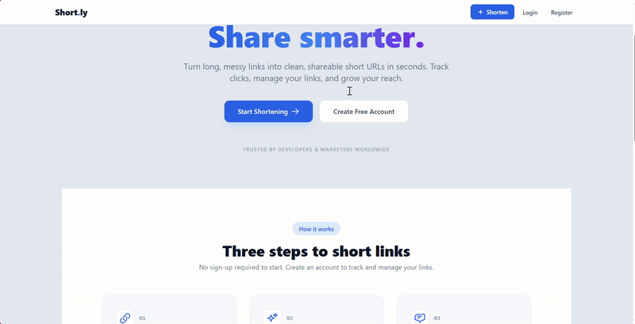

# Full-Stack URL Shortener Service (Short.ly)

A feature-rich, full-stack URL shortening service built with the MERN stack (MongoDB, Express.js, React, Node.js). This application allows users to shorten long URLs, track click analytics, and manage their links through a private, authenticated dashboard.This project is an advanced, full-stack URL Shortener service, built using the MERN tech stack (MongoDB, Express.js, React, Node.js). It goes beyond a basic tool by incorporating a complete user authentication system and a personal dashboard. The core functionality allows any visitor to submit a long URL and receive a shortened, unique link. When this short link is used, the service redirects the user to the original destination while invisibly tracking the number of clicks.

**Live Demo:** [Link to your deployed application]

---

### Screenshot / Demo GIF

*A short GIF demonstrating the core user flow: shortening a URL, logging in, and viewing the link on the personal dashboard.*

---

## Features
The project includes a user registration and login system. Authenticated users get access to a private dashboard where they can view a history of all the links they've created, along with their corresponding short URLs and real-time click counts. This transforms the project from a simple utility into a portfolio-ready, multi-user web application, demonstrating your ability to handle data relationships, build protected APIs, and manage user state in a full-stack environment. The final application will be robust, scalable, and feature-rich, laying the groundwork for a potential future business.

### Key features include:-
-   **Anonymous URL Shortening:** Any visitor can quickly shorten a URL without needing an account.
-   **User Authentication:** A complete JWT-based authentication system for user registration and login.
-   **Password Hashing:** User passwords are securely hashed using `bcryptjs` before being stored.
-   **Protected Routes:** A secure, private dashboard is only accessible to logged-in users.
-   **Personalized Dashboard:** Authenticated users can view a history of all the links they've created.
-   **Click Tracking:** The service tracks and displays the number of clicks for each shortened URL in real-time.
-   **Automatic Redirection:** Short links seamlessly redirect to their original destination.
-   **Responsive UI:** The application is styled with Tailwind CSS for a modern, responsive experience on all devices.
-   **Robust Error Handling:** Features a full-stack error handling pipeline with client-side validation and consistent server responses.

---

## Tech Stack

### Backend

-   **Node.js:** JavaScript runtime environment.
-   **Express.js:** Web framework for Node.js.
-   **MongoDB:** NoSQL database for storing user and URL data.
-   **Mongoose:** Object Data Modeling (ODM) library for MongoDB.
-   **JSON Web Tokens (JWT):** For secure user authentication.
-   **bcryptjs:** For hashing user passwords.
-   **nanoid:** For generating unique and short URL codes.

### Frontend

-   **React.js:** A JavaScript library for building user interfaces.
-   **React Router:** For client-side routing and navigation.
-   **Tailwind CSS:** A utility-first CSS framework for styling.
-   **Axios:** For making HTTP requests to the backend API.
-   **React Context API:** For global state management (authentication).

---
